## MPC-Control

for reviewer:

1. MPC model in detail.

   - init states and reference trajectory

     ```c++
      Eigen::MatrixXd transformGlobal2Vehicle(double x, double y, double psi,
     		const vector<double> & ptsx, const vector<double> & ptsy) {
     	assert(ptsx.size() == ptsy.size());
     	unsigned len = ptsx.size();
     	auto waypoints = Eigen::MatrixXd(2, len);
     	for (auto i = 0; i < len; ++i) {
     		waypoints(0, i) = cos(psi) * (ptsx[i] - x) + sin(psi) * (ptsy[i] - y);
     		waypoints(1, i) = -sin(psi) * (ptsx[i] - x) + cos(psi) * (ptsy[i] - y);
     	}
     	return waypoints;
     }
     ```

     ```c++
     double px = j[1]["x"];
     double py = j[1]["y"];
     double psi = j[1]["psi"];
     double v = j[1]["speed"];
     // Conversion of world coordinates to automobile coordinates
     Eigen::MatrixXd waypoints = transformGlobal2Vehicle(px, py, psi, ptsx, ptsy);
     Eigen::VectorXd Ptsx = waypoints.row(0);
     Eigen::VectorXd Ptsy = waypoints.row(1);
     auto coeffs = polyfit(Ptsx, Ptsy, 3);
     double cte = evaluateCte(coeffs);
     double epsi = evaluateEpsi(coeffs);
     Eigen::VectorXd state(6);
     state << 0, 0, 0, v, cte, epsi;
     ```


   - According to the current state and reference path, the predicted trajectory includes N control points, time points dt at each point, and total time T=N*dt.

     ```c++
     size_t N = 25;
     double dt = 0.05;  // 50ms
     ```

   -  set bounds of variables and equations

     ```c++
     double x = x0[0];
     	double y = x0[1];
     	double psi = x0[2];
     	double v = x0[3];
     	double cte = x0[4];
     	double epsi = x0[5];

     	// 独立状态的个数，注意：驱动器的输入（N - 1）* 2
     	size_t n_vars = N * 6 + (N - 1) * 2;
     	// 约束条件的个数
     	size_t n_constraints = N * 6;

     	// 除了初始值，初始化每一个状态为0
     	Dvector vars(n_vars);
     	for (int i = 0; i < n_vars; i++) {
     		vars[i] = 0.0;
     	}
     	vars[x_start] = x;
     	vars[y_start] = y;
     	vars[psi_start] = psi;
     	vars[v_start] = v;
     	vars[cte_start] = cte;
     	vars[epsi_start] = epsi;

     	// 设置每一个状态变量的最大和最小值
     	// 【1】设置非驱动输入的最大和最小值
     	// 【2】设置方向盘转动角度范围-25—25度
     	// 【3】加速度的范围-1—1
     	Dvector vars_lowerbound(n_vars);
     	Dvector vars_upperbound(n_vars);
     	for (int i = 0; i < delta_start; i++) {
     		vars_lowerbound[i] = -1.0e19;
     		vars_upperbound[i] = 1.0e19;
     	}
     	for (int i = delta_start; i < a_start; i++) {
     		vars_lowerbound[i] = -0.436332;
     		vars_upperbound[i] = 0.436332;
     	}
     	for (int i = a_start; i < n_vars; i++) {
     		vars_lowerbound[i] = -1.0;
     		vars_upperbound[i] = 1.0;
     	}
     	// 前一次计算的驱动器输入作为约束
     	vars_lowerbound[a_start] = a_prev;
     	vars_upperbound[a_start] = a_prev;
     	vars_lowerbound[delta_start] = delta_prev;
     	vars_upperbound[delta_start] = delta_prev;

     	// 设置约束条件的的最大和最小值，除了初始状态其他约束都为0
     	Dvector constraints_lowerbound(n_constraints);
     	Dvector constraints_upperbound(n_constraints);
     	for (int i = 0; i < n_constraints; i++) {
     		constraints_lowerbound[i] = 0;
     		constraints_upperbound[i] = 0;
     	}
     	constraints_lowerbound[x_start] = x;
     	constraints_lowerbound[y_start] = y;
     	constraints_lowerbound[psi_start] = psi;
     	constraints_lowerbound[v_start] = v;
     	constraints_lowerbound[cte_start] = cte;
     	constraints_lowerbound[epsi_start] = epsi;

     	constraints_upperbound[x_start] = x;
     	constraints_upperbound[y_start] = y;
     	constraints_upperbound[psi_start] = psi;
     	constraints_upperbound[v_start] = v;
     	constraints_upperbound[cte_start] = cte;
     	constraints_upperbound[epsi_start] = epsi;
     ```

   - Total cost and constraints equations

     ```c++
     class FG_eval {
     public:

     	// 参考路径方程的系数
     	Eigen::VectorXd coeffs;
     	FG_eval(Eigen::VectorXd coeffs) {
     		this->coeffs = coeffs;
     	}

     	typedef CPPAD_TESTVECTOR(AD<double>)ADvector;

     	// 该函数的目的是定义约束，fg向量包含的是总损失和约束，vars向量包含的是状态值和驱动器的输入
     	void operator()(ADvector& fg, const ADvector& vars) {
     		// 任何cost都会加到fg[0]
     		fg[0] = 0;
     		// 使车辆轨迹和参考路径的误差最小，且使车辆的速度尽量接近参考速度
     		for (int t = 0; t < N; t++) {
     			fg[0] += CppAD::pow(vars[cte_start + t], 2);
     			fg[0] += CppAD::pow(vars[epsi_start + t], 2);
     			fg[0] += CppAD::pow(vars[v_start + t] - ref_v, 2);
     		}
     		// 使车辆行驶更平稳，尽量减少每一次驱动器的输入大小
     		// 注意：驱动器的输入是N-1个.最后一个点没有驱动器输入
     		for (int t = 0; t < N - 1; t++) {
     			fg[0] += CppAD::pow(vars[delta_start + t], 2);
     			fg[0] += CppAD::pow(vars[a_start + t], 2);
     		}
     		// 为了使车辆运动更平滑，尽量减少相邻两次驱动器输入的差距
     		// 注意：这个地方是N-2个
     		for (int t = 0; t < N - 2; t++) {
     			fg[0] += 600*CppAD::pow(vars[delta_start + t + 1] - vars[delta_start + t], 2);
     			fg[0] += CppAD::pow(vars[a_start + t + 1] - vars[a_start + t], 2);
     		}
     		for (int t = 0; t < N - 2; t++) {
     			fg[0] += 600*CppAD::pow(vars[delta_start + t + 1] - vars[delta_start + t], 2);
     			fg[0] += CppAD::pow(vars[a_start + t + 1] - vars[a_start + t], 2);
     		}

     		// 设置fg的初始值为状态的初始值，这个地方为初始条件约束
     		fg[1 + x_start] = vars[x_start];
     		fg[1 + y_start] = vars[y_start];
     		fg[1 + psi_start] = vars[psi_start];
     		fg[1 + v_start] = vars[v_start];
     		fg[1 + cte_start] = vars[cte_start];
     		fg[1 + epsi_start] = vars[epsi_start];

     		// 因为t=0初始条件约束已经有了，计算其他约束条件
     		for (int t = 1; t < N; t++) {
     			// t+1时刻的状态
     			AD<double> x1 = vars[x_start + t];
     			AD<double> y1 = vars[y_start + t];
     			AD<double> psi1 = vars[psi_start + t];
     			AD<double> v1 = vars[v_start + t];
     			AD<double> cte1 = vars[cte_start + t];
     			AD<double> epsi1 = vars[epsi_start + t];

     			// t时刻的状态
     			AD<double> x0 = vars[x_start + t - 1];
     			AD<double> y0 = vars[y_start + t - 1];
     			AD<double> psi0 = vars[psi_start + t - 1];
     			AD<double> v0 = vars[v_start + t - 1];
     			AD<double> cte0 = vars[cte_start + t - 1];
     			AD<double> epsi0 = vars[epsi_start + t - 1];
     			// t时刻的驱动器输入
     			AD<double> delta0 = vars[delta_start + t - 1];
     			AD<double> a0 = vars[a_start + t - 1];

     			// t时刻参考路径的距离和角度值
     			AD<double> f0 = coeffs[0] + coeffs[1] * x0 + coeffs[2]*x0*x0 + coeffs[3]*x0*x0*x0;
     			AD<double> psides0 = CppAD::atan(coeffs[1]+2*coeffs[2]*x0 + 3 * coeffs[3]*x0*x0);

     			// 根据如上的状态值计算约束条件
     			fg[1 + x_start + t] = x1 - (x0 + v0 * CppAD::cos(psi0) * dt);
     			fg[1 + y_start + t] = y1 - (y0 + v0 * CppAD::sin(psi0) * dt);
     			fg[1 + psi_start + t] = psi1 - (psi0 + v0 * delta0 / Lf * dt);
     			fg[1 + v_start + t] = v1 - (v0 + a0 * dt);
     			fg[1 + cte_start + t] = cte1 - ((f0 - y0) + (v0 * CppAD::sin(epsi0) * dt));
     			fg[1 + epsi_start + t] = epsi1 - ((psi0 - psides0) + v0 * delta0 / Lf * dt);
     		}
     	}
     };
     ```

   - solve the optimizer problem

     ```c++
     // Object that computes objective and constraints
     	FG_eval fg_eval(coeffs);

     // options
     std::string options;
     options += "Integer print_level  0\n";
     options += "Sparse  true        forward\n";
     options += "Sparse  true        reverse\n";

     // 计算这个问题
     CppAD::ipopt::solve_result<Dvector> solution;
     CppAD::ipopt::solve<Dvector, FG_eval>(options, vars, vars_lowerbound,
                                           vars_upperbound, constraints_lowerbound, constraints_upperbound,
                                           fg_eval, solution);
     ```

   - Passing the predicted result to the actuator and recursion to the next task.

2. the reasoning behind the chosen *N* (timestep length) and *dt* (elapsed duration between timesteps) values. 

   > A good approach to setting *N*, *dt*, and *T* is to first determine a reasonable range for *T* and then tune *dt* and *N* appropriately, keeping the effect of each in mind.

   - T = dt**N,*N should be as large as possible, while *dt* should be as small as possible.in the case of driving a car, *T* should be a few seconds。

   - *N* determines the number of variables optimized by the MPC,so too many points will increase the cost of computing。

   -  Larger values of *dt* result in less frequent actuations, which makes it harder to accurately approximate a continuous reference trajectory。

     the result of set dt=0.1 and N=20

     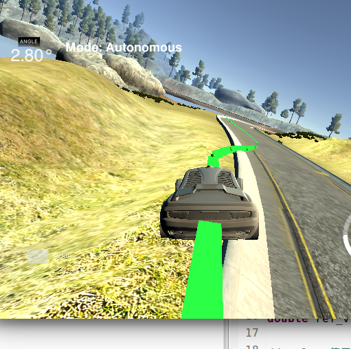

     correct result

     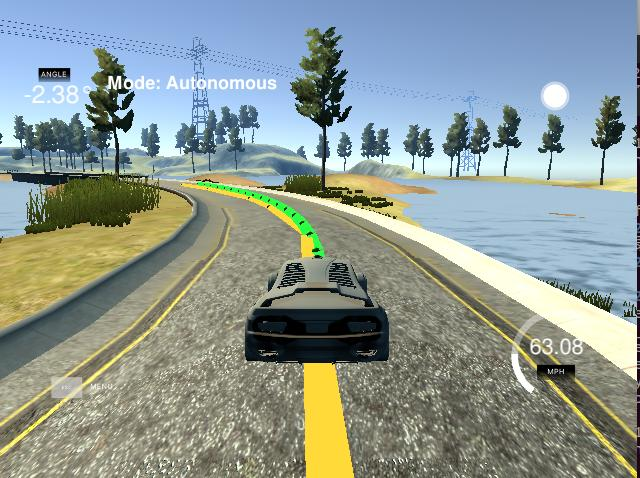

     ​

3. implements Model Predictive Control that handles a 100 millisecond latency. 

   > set　N = 20，dt = 0.05，so T=100ms

   ```c++
   size_t N = 20;
   double dt = 0.05; // 50ms
   ```

   >Take the next value of the predicted result, mpc.latency=1

   ```c++
   double steer_value = result[2][mpc.latency];
   double throttle_value = result[3][mpc.latency];
   ```

   > simulator lantency 

   ```c++
   this_thread::sleep_for(chrono::milliseconds(100));
   ```


简介

1. 运动学模型：忽略了轮胎的力，重力和质量的影响。
2. 动力学模型：考虑了轮胎的力，纵向和横向受到的力，重力，惯性，质量，以及车子的结构等。

- 状态

  > 和追踪车辆状态一样，当前车辆模型预测包括位置x，y，角度ψ，速度v

  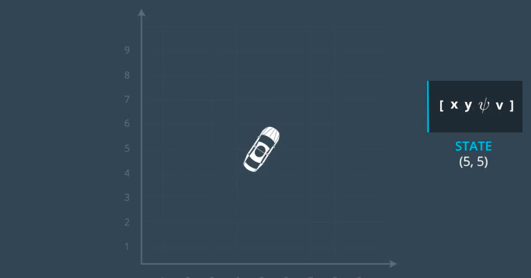

- 汽车的运动学模型

  > 为了使得我们实际的车的状态和汽车预测状态之间的误差最小，我们需要控制车辆驱动。
  >
  > 包括方向盘和加速/刹车输入。

  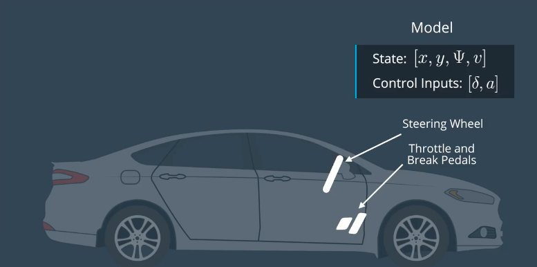

  > 根据上一时刻的汽车状态，预测下一时刻的状态，公式
  >
  > **注意：Lf表示汽车的头部到汽车重心的距离，距离越大，转向角越小，反之亦然。  比如，大货车的转向角度要比小轿车的转向角度小，在转动方向盘相同角度的情况下**

  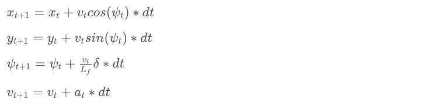

  > 实现运动学模型

  ```c++
  #include <math.h>
  #include <iostream>
  #include "Dense"

  double pi() { return M_PI; }
  double deg2rad(double x) { return x * pi() / 180; }
  double rad2deg(double x) { return x * 180 / pi(); }

  const double Lf = 2;

  Eigen::VectorXd globalKinematic(Eigen::VectorXd state,
                                  Eigen::VectorXd actuators, double dt) {
    Eigen::VectorXd next_state(state.size());
    
    // the next state from inputs
    next_state[0] = state[0] + state[3]*cos(state[2])*dt;
    next_state[1] = state[1] + state[3]*sin(state[2])*dt;
    next_state[2] = state[2] + state[3]/Lf*actuators[0]*dt;
    next_state[3] = state[3] + actuators[1]*dt;
    
    return next_state;
  }

  int main() {
    // [x, y, psi, v]
    Eigen::VectorXd state(4);
    Eigen::VectorXd actuators(2);
    state << 0, 0, deg2rad(45), 1;
    actuators << deg2rad(5), 1;
    Eigen::VectorXd next_state = globalKinematic(state, actuators, 0.3);
    std::cout << next_state << std::endl;
  }
  ```

- 无人驾驶的整体过程

  > 感知 => 定位 => 路径规划 => 车辆控制

  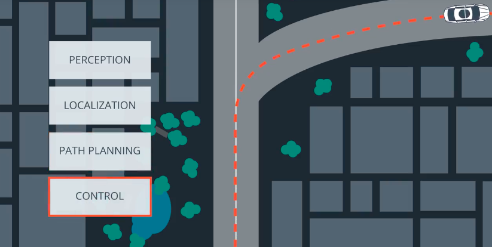

- 使用多项式拟合规划路径

  > 一般三次多项式就能满足要求

  ```c++
  #include <iostream>
  #include "Dense"

  using namespace Eigen;

  // 传入方程的系数和X值求方程的输出y
  double polyeval(Eigen::VectorXd coeffs, double x) {
    double result = 0.0;
    for (int i = 0; i < coeffs.size(); i++) {
      result += coeffs[i] * pow(x, i);
    }
    return result;
  }

  // https://github.com/JuliaMath/Polynomials.jl/blob/master/src/Polynomials.jl#L676-L716
  // 这个函数的作用是传入未知数x，y和方程的最高次数order，根据未知数建立矩阵方程，使用Qr分解解得位置参
  // 数，其实也就是用点去拟合曲线
  Eigen::VectorXd polyfit(Eigen::VectorXd xvals, Eigen::VectorXd yvals, int order) {
    assert(xvals.size() == yvals.size());
    assert(order >= 1 && order <= xvals.size() - 1);
    Eigen::MatrixXd A(xvals.size(), order + 1);
    for (int i = 0; i < xvals.size(); i++) {
      A(i, 0) = 1.0;
    }
    for (int j = 0; j < xvals.size(); j++) {
      for (int i = 0; i < order; i++) {
        A(j, i + 1) = A(j, i) * xvals(j);
      }
    }
    auto Q = A.householderQr();
    auto result = Q.solve(yvals);
    return result;
  }

  int main() {
    Eigen::VectorXd xvals(6);
    Eigen::VectorXd yvals(6);
    xvals << 9.261977, -2.06803, -19.6663, -36.868, -51.6263, -66.3482;
    yvals << 5.17, -2.25, -15.306, -29.46, -42.85, -57.6116;
    // 拟合出的曲线的系数
    Eigen::VectorXd fit_curve = polyfit(xvals, yvals, 3);
    // 测试点
    for (double x = 0; x <= 20; x += 1.0) {
      std::cout << polyeval(fit_curve, x) << std::endl; 
    }
  }
  ```

- Cross Track Error（CTE），距离误差

  > 通过前一个状态的误差，估计后一状态的误差。
  >
  > yt表示当前所在的位置，f(xt)表示预测路径所在的位置
  >
  > 注意：这个地方使用的是eψt，表示和真实轨迹运动方向的差距
  >
  > ctet+1 = ctet  +  vt∗sin(eψt)∗dt
  >
  > ctet = yt − f(xt)
  >
  > 合并：
  >
  > ctet+1 = yt − f(xt) + (vt∗sin(eψt)∗dt)

- Orientation Error，方向误差

  注意：我们并不知道ψdest的规划路径的角度值，可以使用求斜率，再求arctan的方式求得，arctan(f′(xt))。

  

  

  合并：

  

- 预测轨迹和参考轨迹之间的误差

  >  把错误的变化包括到状态中 ，那么新的状态向量为 [x,y,ψ,v,cte,eψ]，向量一共六维。
  >
  >  注意到增加了cte和eψ，表示和到预测路径距离的错误和预测路径方向的错误。


## MPC(模型预测控制)

模型预测把路径追踪任务变成了一个优化问题，即寻找最小成本的轨迹，这个地方的成本就是指在满足指定限制条件的基础上，使得路径和参考路径的距离值和角度值最贴近。

总体步骤：

1. 获取当前状态和参考路径
2. 根据当前状态和参考路径，预测轨迹，包括N个控制点，每个点控制的时间段dt，总时间T=N*dt。
3. 控制驱动器输入，第一个控制点的数据。
4. 第一个控制点完成之后，从第一步再递归进行。

> 为什么不进行一次性预测完成，执行每个控制点之后走完，再预测？
>
> 因为现实世界会有各种误差，导致实际情况并不是和预测轨迹一致，所以预测一次走一个控制点。所以MPC也叫“滚动时域控制”。

- 计算误差

  > 为了减小误差，我们需要调整驱动器输入，控制车辆实际的预测路线和参考路线的距离和方向误差尽可能的小。

  计算每一个时间点的误差累计：

  ```c++
  double cost = 0;
  for (int t = 0; t < N; t++) {
      cost += pow(cte[t], 2);
      cost += pow(epsi[t], 2);
  }
  ```

  但是如上的代码可能有两个问题：

  1. 车辆可能在其中的某个位置停止。
  2. 车辆的行驶线路可能是很不平滑的。

  解决车辆可能停止的办法：

  1. 把速度加入成本函数。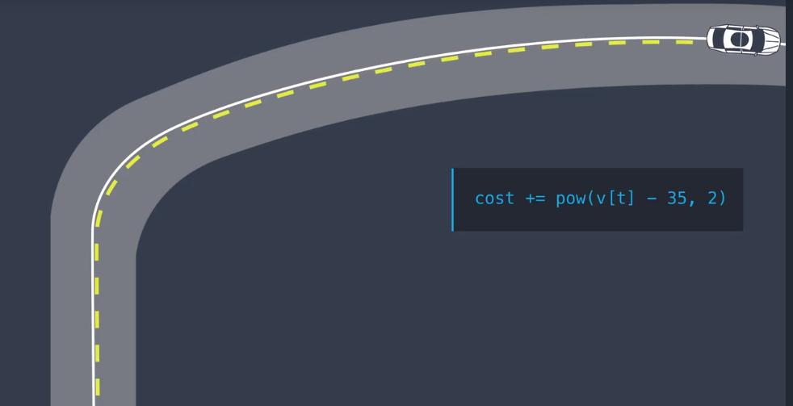
  2. 把当前位置距离终点的距离加入成本函数。

     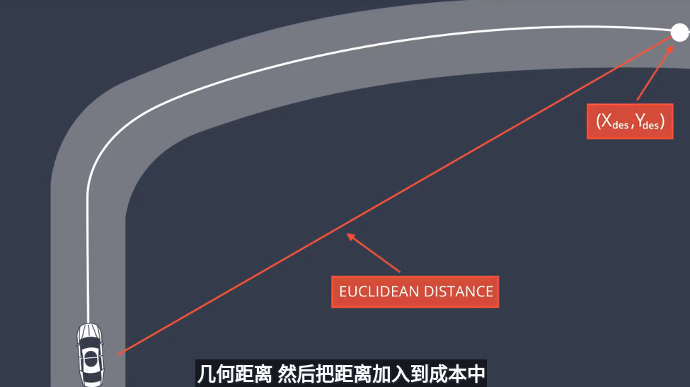

- 解决行驶线路不平滑的问题：把车辆控制参数加入成本函数,两次控制的变化不能太大。 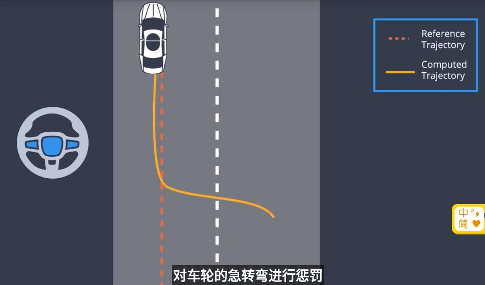

- 预测线路区间T，由两部分组成N和dt，其中，N表示预测线路有多少个预测点，dt表示每一个预测点的执行的时间。例如：假设一共有20个预测点N=20，每个预测点的时间dt=0.5，则T为20x0.5=10秒。

  注意：在下面的图中状态点有7个但是驱动控制向量只有6个，可以这样理解，驱动控制的结果是下一个状态点，最后一个状态点没有下一个状态点，所以不需要驱动输入。

  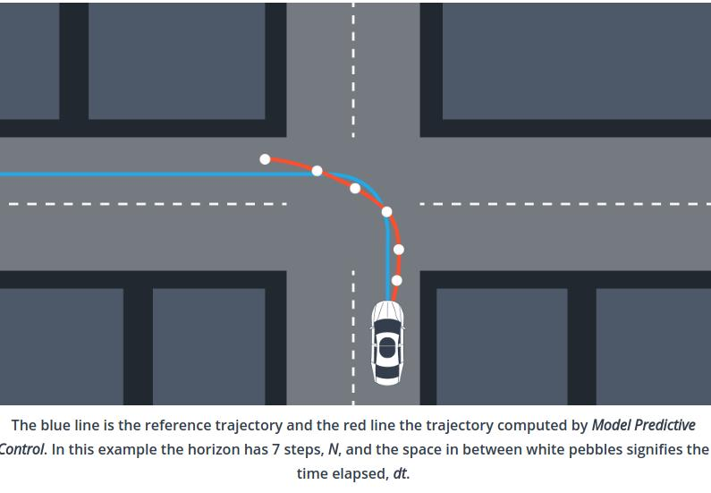

- 计算流程

  

- PID和MPC的优缺点比较

  PID：有延迟影响，PID基于当前的状态计算出驱动指令，向驱动器发送命令到驱动器执行完成，这之间有一个延迟的过程，差不多100ms，所以等到执行命令的时候状态已经变化，会出现不稳定的情况。

  MPC：由于MPC有预测模型，通过当前状态能预测出下一状态，比如：在获取到预测的路线之后，取第二个点作为驱动输入。

  **总结：MPC控制比PID控制在处理延迟方面更加的高效。**

- 需要用到的一些库

  [Ipopt](https://projects.coin-or.org/Ipopt/)：可以通过使得最小化成本函数，获得最优驱动输入[δ1,a1,...,δN−1,aN−1]，由于需要加上驱动限制Ipopt 需要使用雅可比(jacobians)和黑塞(haishens)矩阵，他不会直接计算，所以使用到了CppAD。

  [CppAD](https://www.coin-or.org/CppAD/)：用于求自动微分，调用数学函数的时候需要使用CppAD::作为前缀，比如：```CppAD::pow(x, 2);```，使用CppAD的返回类型，比如：```CppAD<double>```代替```double```。

- 代码片段

  ```c++
  // 所有预测的状态值存储到一个向量里边，所以需要确定每种状态在向量中的开始位置
  size_t x_start = 0;
  size_t y_start = x_start + N;
  size_t psi_start = y_start + N;
  size_t v_start = psi_start + N;
  size_t cte_start = v_start + N;
  size_t epsi_start = cte_start + N;
  size_t delta_start = epsi_start + N;
  size_t a_start = delta_start + N - 1;
  ```

- 变量之间关系约束

  ```c++
  class FG_eval {
  public:
      // 参考路线方程的系数
  	Eigen::VectorXd coeffs;
  	FG_eval(Eigen::VectorXd coeffs) {
  		this->coeffs = coeffs;
  	}

  	typedef CPPAD_TESTVECTOR(AD<double>) ADvector;

  	// 该函数的目的是定义约束，fg向量包含的是总损失和约束，vars向量包含的是状态值和驱动器的输入
  	void operator()(ADvector& fg, const ADvector& vars) {
  		// 任何cost都会加到fg[0]
  		fg[0] = 0;
  		// 使车辆轨迹和参考路径的误差最小，且使车辆的速度尽量接近参考速度
  		for (int t = 0; t < N; t++) {
  			fg[0] += CppAD::pow(vars[cte_start + t], 2);
  			fg[0] += CppAD::pow(vars[epsi_start + t], 2);
  			fg[0] += CppAD::pow(vars[v_start + t] - ref_v, 2);
  		}
  		// 使车辆行驶更平稳，尽量减少每一次驱动器的输入大小
  		// 注意：驱动器的输入是N-1个.最后一个点没有驱动器输入
  		for (int t = 0; t < N - 1; t++) {
  			fg[0] += CppAD::pow(vars[delta_start + t], 2);
  			fg[0] += CppAD::pow(vars[a_start + t], 2);
  		}
  		// 为了使车辆运动更平滑，尽量减少相邻两次驱动器输入的差距
  		// 注意：这个地方是N-2个
  		for (int t = 0; t < N - 2; t++) {
  			fg[0] += 600*CppAD::pow(vars[delta_start + t + 1] - vars[delta_start + t], 2);
  			fg[0] += CppAD::pow(vars[a_start + t + 1] - vars[a_start + t], 2);
  		}
  		for (int t = 0; t < N - 2; t++) {
  			fg[0] += 600*CppAD::pow(vars[delta_start + t + 1] - vars[delta_start + t], 2);
  			fg[0] += CppAD::pow(vars[a_start + t + 1] - vars[a_start + t], 2);
  		}

  		// 设置fg的初始值为状态的初始值，这个地方为初始条件约束
  		fg[1 + x_start] = vars[x_start];
  		fg[1 + y_start] = vars[y_start];
  		fg[1 + psi_start] = vars[psi_start];
  		fg[1 + v_start] = vars[v_start];
  		fg[1 + cte_start] = vars[cte_start];
  		fg[1 + epsi_start] = vars[epsi_start];

  		// 因为t=0初始条件约束已经有了，计算其他约束条件
  		for (int t = 1; t < N; t++) {
  			// t+1时刻的状态
  			AD<double> x1 = vars[x_start + t];
  			AD<double> y1 = vars[y_start + t];
  			AD<double> psi1 = vars[psi_start + t];
  			AD<double> v1 = vars[v_start + t];
  			AD<double> cte1 = vars[cte_start + t];
  			AD<double> epsi1 = vars[epsi_start + t];

  			// t时刻的状态
  			AD<double> x0 = vars[x_start + t - 1];
  			AD<double> y0 = vars[y_start + t - 1];
  			AD<double> psi0 = vars[psi_start + t - 1];
  			AD<double> v0 = vars[v_start + t - 1];
  			AD<double> cte0 = vars[cte_start + t - 1];
  			AD<double> epsi0 = vars[epsi_start + t - 1];
  			// t时刻的驱动器输入
  			AD<double> delta0 = vars[delta_start + t - 1];
  			AD<double> a0 = vars[a_start + t - 1];

  			// t时刻参考路径的距离和角度值
  			AD<double> f0 = coeffs[0] + coeffs[1] * x0 + coeffs[2]*x0*x0 + coeffs[3]*x0*x0*x0;
  			AD<double> psides0 = CppAD::atan(coeffs[1]+2*coeffs[2]*x0 + 3 * coeffs[3]*x0*x0);

  			// 根据如上的状态值计算约束条件
  			fg[1 + x_start + t] = x1 - (x0 + v0 * CppAD::cos(psi0) * dt);
  			fg[1 + y_start + t] = y1 - (y0 + v0 * CppAD::sin(psi0) * dt);
  			fg[1 + psi_start + t] = psi1 - (psi0 + v0 * delta0 / Lf * dt);
  			fg[1 + v_start + t] = v1 - (v0 + a0 * dt);
  			fg[1 + cte_start + t] = cte1 - ((f0 - y0) + (v0 * CppAD::sin(epsi0) * dt));
  			fg[1 + epsi_start + t] = epsi1 - ((psi0 - psides0) + v0 * delta0 / Lf * dt);
  		}
  	}
  };
  ```

- MPC

  > 确定每一个变量的初始值和取值范围，没有初始值的默认都设为0

  ```c++
  vector<vector<double>> MPC::Solve(Eigen::VectorXd x0, Eigen::VectorXd coeffs) {
  	size_t i;
  	typedef CPPAD_TESTVECTOR(double)Dvector;

  	double x = x0[0];
  	double y = x0[1];
  	double psi = x0[2];
  	double v = x0[3];
  	double cte = x0[4];
  	double epsi = x0[5];

  	// 独立状态的个数，注意：驱动器的输入（N - 1）* 2
  	size_t n_vars = N * 6 + (N - 1) * 2;
  	
      // 约束条件的个数
  	size_t n_constraints = N * 6;

  	// 除了初始值，初始化每一个状态为0
  	Dvector vars(n_vars);
  	for (int i = 0; i < n_vars; i++) {
  		vars[i] = 0.0;
  	}
  	vars[x_start] = x;
  	vars[y_start] = y;
  	vars[psi_start] = psi;
  	vars[v_start] = v;
  	vars[cte_start] = cte;
  	vars[epsi_start] = epsi;

  	// 设置每一个状态变量的最大和最小值
  	// 【1】设置非驱动输入的最大和最小值
  	// 【2】设置方向盘转动角度范围-25—25度
  	// 【3】加速度的范围-1—1
  	Dvector vars_lowerbound(n_vars);
  	Dvector vars_upperbound(n_vars);
  	for (int i = 0; i < delta_start; i++) {
  		vars_lowerbound[i] = -1.0e19;
  		vars_upperbound[i] = 1.0e19;
  	}
  	for (int i = delta_start; i < a_start; i++) {
  		vars_lowerbound[i] = -0.436332;
  		vars_upperbound[i] = 0.436332;
  	}
  	for (int i = a_start; i < n_vars; i++) {
  		vars_lowerbound[i] = -1.0;
  		vars_upperbound[i] = 1.0;
  	}
  	// 前一次计算的驱动器输入作为约束
  	vars_lowerbound[a_start] = a_prev;
  	vars_upperbound[a_start] = a_prev;
      vars_lowerbound[delta_start] = delta_prev;
      vars_upperbound[delta_start] = delta_prev;

  	// 设置约束条件的的最大和最小值，除了初始状态其他约束都为0
  	Dvector constraints_lowerbound(n_constraints);
  	Dvector constraints_upperbound(n_constraints);
  	for (int i = 0; i < n_constraints; i++) {
  		constraints_lowerbound[i] = 0;
  		constraints_upperbound[i] = 0;
  	}
  	constraints_lowerbound[x_start] = x;
  	constraints_lowerbound[y_start] = y;
  	constraints_lowerbound[psi_start] = psi;
  	constraints_lowerbound[v_start] = v;
  	constraints_lowerbound[cte_start] = cte;
  	constraints_lowerbound[epsi_start] = epsi;

  	constraints_upperbound[x_start] = x;
  	constraints_upperbound[y_start] = y;
  	constraints_upperbound[psi_start] = psi;
  	constraints_upperbound[v_start] = v;
  	constraints_upperbound[cte_start] = cte;
  	constraints_upperbound[epsi_start] = epsi;

  	// Object that computes objective and constraints
  	FG_eval fg_eval(coeffs);

  	// options
  	std::string options;
  	options += "Integer print_level  0\n";
  	options += "Sparse  true        forward\n";
  	options += "Sparse  true        reverse\n";

  	// 计算这个问题
  	CppAD::ipopt::solve_result<Dvector> solution;
  	CppAD::ipopt::solve<Dvector, FG_eval>(options, vars, vars_lowerbound,
  			vars_upperbound, constraints_lowerbound, constraints_upperbound,
  			fg_eval, solution);

  	// 返回值
  	bool ok = true;
  	ok &= solution.status == CppAD::ipopt::solve_result<Dvector>::success;
  	auto cost = solution.obj_value;
  	std::cout << "Cost " << cost << std::endl;

  	// 返回预测出的轨迹点状态
  	vector<double> X;
  	vector<double> Y;
  	vector<double> Delta;
  	vector<double> A;
  	for (auto i = 0; i < N - 1; i++) {
  		X.push_back(solution.x[x_start + i]);
  		Y.push_back(solution.x[y_start + i]);
  		Delta.push_back(solution.x[delta_start + i]);
  		A.push_back(solution.x[a_start + i]);
  	}
  	vector<vector<double>> result;
  	result.push_back(X);
  	result.push_back(Y);
  	result.push_back(Delta);
  	result.push_back(A);
  	return result;
  }
  ```

- 坐标转换

  > 把世界坐标转换为汽车坐标，以当前汽车的位置作为源点
  >
  > 1. 计算出相对位置，即参考轨迹坐标减去车辆坐标，ptsx[i] - x
  > 2. 坐标旋转
  >
  > 这时车辆当前位置的坐标x，y和方向都为0，由于相对位置没有改变，所以结果不变，但是计算相对简单。

  关于怎么旋转画了个图理解：

  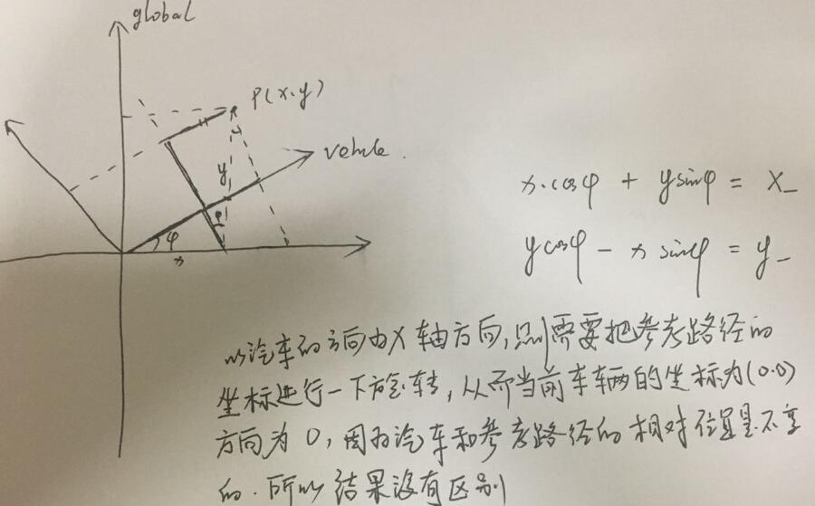

  ```c++
  Eigen::MatrixXd transformGlobal2Vehicle(double x, double y, double psi,
  		const vector<double> & ptsx, const vector<double> & ptsy) {
  	assert(ptsx.size() == ptsy.size());
  	unsigned len = ptsx.size();
  	auto waypoints = Eigen::MatrixXd(2, len);
  	for (auto i = 0; i < len; ++i) {
  		waypoints(0, i) = cos(psi) * (ptsx[i] - x) + sin(psi) * (ptsy[i] - y);
  		waypoints(1, i) = -sin(psi) * (ptsx[i] - x) + cos(psi) * (ptsy[i] - y);
  	}
  	return waypoints;
  }

  ```

- 误差值

  > 由于转换到当前车辆位置为原点的坐标了，所以误差值也很好计算了
  >
  > 距离误差：只计算源点到曲线的y距离
  >
  > 方向误差：计算曲线的角度值

  ```c++
  // 计算CTE误差
  double evaluateCte(Eigen::VectorXd coeffs) {
      return polyeval(coeffs, 0);
  }

  // 计算Epsi误差
  double evaluateEpsi(Eigen::VectorXd coeffs) {
      return -atan(coeffs[1]);
  }
  ```

- 处理返回的结果值,main()

  > 注意：取到的驱动器输入应该取延迟时间之后的输入
  >
  > 比如：延迟100ms，相邻点的时间间隔是50ms，则取第三个输入，没有延迟取第一个，延迟50ms取第二个，延迟100ms所以取第三个。

  ```c++
  // json对象数据
  vector<double> ptsx = j[1]["ptsx"];
  vector<double> ptsy = j[1]["ptsy"];
  double px = j[1]["x"];
  double py = j[1]["y"];
  double psi = j[1]["psi"];
  double v = j[1]["speed"];

  // 转换坐标到当前车辆为源点的坐标
  Eigen::MatrixXd waypoints = transformGlobal2Vehicle(px, py, psi, ptsx, ptsy);
  Eigen::VectorXd Ptsx = waypoints.row(0);
  Eigen::VectorXd Ptsy = waypoints.row(1);

  // 获取状态值
  auto coeffs = polyfit(Ptsx, Ptsy, 3);
  double cte = evaluateCte(coeffs);
  double epsi = evaluateEpsi(coeffs);
  Eigen::VectorXd state(6);
  state << 0, 0, 0, v, cte, epsi;

  // 计算方向和油门，范围都在[-1, 1]之间
  // 这个地方根据延迟的时间去判断选取哪一个点的驱动器输入
  vector<vector<double>> result = mpc.Solve(state, coeffs);
  double steer_value = result[2][mpc.latency];
  double throttle_value = result[3][mpc.latency];

  // 设置当前输入作为下下一时刻的驱动器初始值
  mpc.delta_prev = steer_value;
  mpc.a_prev = throttle_value;

  // 注意：需要把角度范围转换到-1到1
  json msgJson;
  msgJson["steering_angle"] = -steer_value/0.436332;
  msgJson["throttle"] = throttle_value;

  // 展示MPC预测的路径
  vector<double> mpc_x_vals=result[0];
  vector<double> mpc_y_vals=result[1];
  msgJson["mpc_x"] = mpc_x_vals;
  msgJson["mpc_y"] = mpc_y_vals;

  // 展示参考路径
  vector<double> next_x_vals;
  vector<double> next_y_vals;
  for (unsigned i=0; i < ptsx.size(); ++i) {
      next_x_vals.push_back(Ptsx(i));
      next_y_vals.push_back(Ptsy(i));
  }
  msgJson["next_x"] = next_x_vals;
  msgJson["next_y"] = next_y_vals;
  ```

- 设置延迟时间100ms

  ```c++
  this_thread::sleep_for(chrono::milliseconds(100));
  ```

- 在模拟器中的运行结果

  

- 需要的运行环境

  - cmake >= 3.5

  - All OSes: [click here for installation instructions](https://cmake.org/install/)

  - make >= 4.1(mac, linux), 3.81(Windows)

    - Linux: make is installed by default on most Linux distros
    - Mac: [install Xcode command line tools to get make](https://developer.apple.com/xcode/features/)
    - Windows: [Click here for installation instructions](http://gnuwin32.sourceforge.net/packages/make.htm)

  - gcc/g++ >= 5.4

    - Linux: gcc / g++ is installed by default on most Linux distros
    - Mac: same deal as make - [install Xcode command line tools]((<https://developer.apple.com/xcode/features/>)
    - Windows: recommend using [MinGW](http://www.mingw.org/)

  - [uWebSockets](https://github.com/uWebSockets/uWebSockets)

    - Run either `install-mac.sh` or `install-ubuntu.sh`.

    - If you install from source, checkout to commit 

      ```
      e94b6e1
      ```

      , i.e.

      ```
      git clone https://github.com/uWebSockets/uWebSockets
      cd uWebSockets
      git checkout e94b6e1
      ```

      Some function signatures have changed in v0.14.x. See 

      this PR

       for more details.

  - **Ipopt and CppAD:** Please refer to [this document](https://github.com/udacity/CarND-MPC-Project/blob/master/install_Ipopt_CppAD.md) for installation instructions.

  - [Eigen](http://eigen.tuxfamily.org/index.php?title=Main_Page). This is already part of the repo so you shouldn't have to worry about it.

  - Simulator. You can download these from the [releases tab](https://github.com/udacity/self-driving-car-sim/releases).

  - Not a dependency but read the [DATA.md](https://github.com/tonyxxq/MPC-Control/blob/master/DATA.md) for a description of the data sent back from the simulator.

- 项目运行

  1. Clone this repo.
  2. Make a build directory: `mkdir build && cd build`
  3. Compile: `cmake .. && make`
  4. Run it: `./mpc`.

